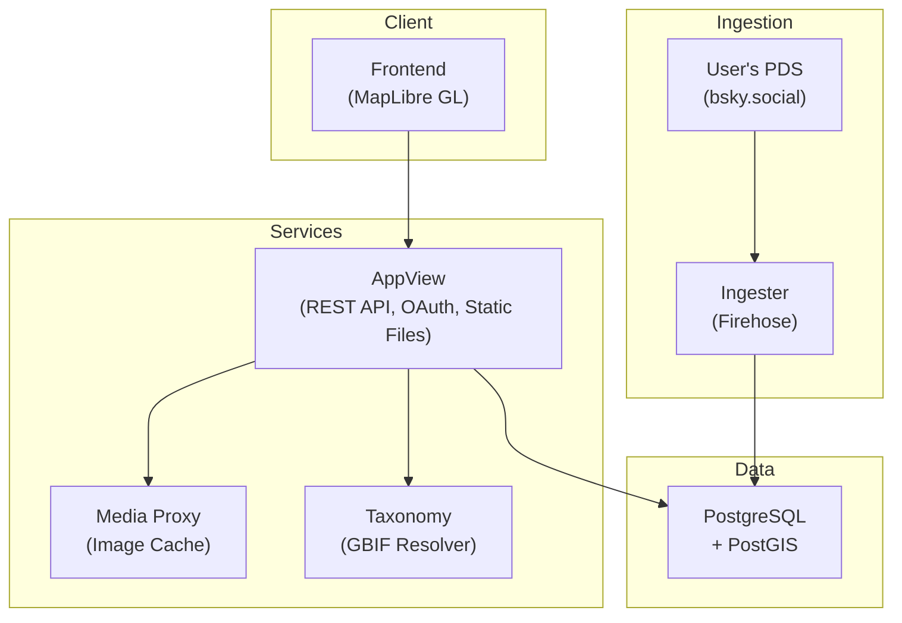

# Architecture

## System Overview



## Project Structure

```
crates/
├── observing-appview/     # Unified REST API + OAuth + static serving (Rust/Axum)
├── observing-db/          # Shared database layer (Rust)
├── observing-geocoding/   # Nominatim reverse geocoding (Rust)
├── observing-identity/    # DID/handle resolution + profile caching (Rust)
├── observing-ingester/    # AT Protocol firehose consumer (Rust)
├── observing-lexicons/    # Generated AT Protocol record types (Rust)
├── observing-media-proxy/ # Image caching proxy (Rust)
├── observing-taxonomy/    # GBIF taxonomy resolver service (Rust)
└── gbif-api/              # GBIF API client (Rust)

packages/
├── observing-frontend/    # Web UI (Vite + React + MapLibre GL)
└── observing-lexicon/     # Lexicon TypeScript type generation
```

## Components

### Lexicons (`lexicons/`)

Darwin Core compliant schemas for biodiversity data following [TDWG standards](https://dwc.tdwg.org/):

- `org.rwell.test.occurrence` - Occurrence records
- `org.rwell.test.identification` - Taxonomic determinations
- `org.rwell.test.comment` - Discussion comments
- `org.rwell.test.interaction` - Species interactions
- `org.rwell.test.like` / `app.bsky.feed.like` - Likes

### AppView (`crates/observing-appview/`)

Unified Rust/Axum server handling all backend concerns:

- **REST API** - Occurrences, identifications, comments, feeds, profiles, taxonomy, interactions, likes
- **OAuth** - AT Protocol authentication via `atrium-oauth`
- **AT Protocol Client** - Record create/update/delete, blob upload via internal RPC
- **Static Files** - Serves the built React frontend
- **Data Enrichment** - Profile resolution, community IDs, image URLs, effective taxonomy

### Ingester (`crates/observing-ingester/`)

Rust service that monitors the AT Protocol firehose.

- **Firehose** - WebSocket client subscribing to the AT Protocol relay
- **Event Processing** - Handles occurrence, identification, comment, interaction, and like records
- **Built with** - Tokio, SQLx

### Media Proxy (`crates/observing-media-proxy/`)

Rust image caching service.

- **Image Cache** - Caches and proxies image blobs from PDS servers
- **Stateless** - No database, filesystem cache only

### Taxonomy (`crates/observing-taxonomy/`)

Rust taxonomy resolution service.

- **GBIF Lookups** - Species search, validation, and taxonomy hierarchy
- **Wikidata** - Species image and metadata enrichment
- **Caching** - In-memory cache for frequently accessed taxa

### Frontend (`packages/observing-frontend/`)

Vite + React SPA.

- **Map** - MapLibre GL with clustered occurrence markers
- **Uploader** - Photo capture, EXIF extraction, occurrence submission
- **Identification** - Agree/Suggest ID interface

## Key Files

- `lexicons/` - AT Protocol lexicon definitions
- `crates/observing-appview/src/routes/` - REST API endpoint handlers
- `crates/observing-appview/src/enrichment.rs` - Response enrichment (profiles, community IDs)
- `crates/observing-db/src/` - PostgreSQL + PostGIS database layer
- `crates/observing-appview/src/routes/oauth.rs` - OAuth authentication
- `scripts/generate-rust-types.sh` - Lexicon → Rust type generator (jacquard-codegen)
- `cloudbuild.yaml` - Multi-service Cloud Build config

## Community Identification

Consensus algorithm similar to iNaturalist:

- **Research Grade**: 2+ identifications with 2/3 majority on species
- **Needs ID**: Has identifications but no consensus
- **Casual**: No identifications yet

Calculated in real-time, stored in a materialized view.

## Data Ownership

Unlike centralized platforms, data is stored on users' Personal Data Servers (PDS):

- **Your data, your server** - Observations are AT Protocol records you control
- **Portable** - Move your data between PDS providers
- **Interoperable** - Darwin Core standards for scientific use
- **Federated** - No single point of failure
