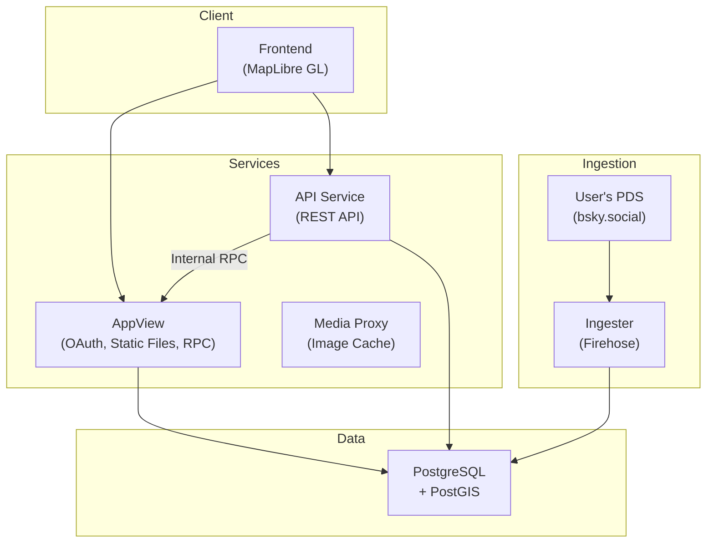

# Architecture

## System Overview



## Package Structure

```
packages/
├── biosky-api/         # REST API server (Express)
├── biosky-appview/     # OAuth, static files, internal RPC (Express)
├── biosky-ingester/    # AT Protocol firehose consumer (Rust)
├── biosky-media-proxy/ # Image caching proxy (Rust)
└── biosky-frontend/    # Web UI (Vite + MapLibre GL)
```

### Package Dependencies

```
biosky-api (TypeScript, calls appview for AT Protocol writes)
biosky-appview (TypeScript, handles OAuth and PDS operations)
biosky-frontend (communicates with api and appview via REST)
biosky-media-proxy (standalone Rust binary)
biosky-ingester (standalone Rust binary)
```

## Components

### Lexicons (`lexicons/`)

Darwin Core compliant schemas for biodiversity data following [TDWG standards](https://dwc.tdwg.org/):

- `org.rwell.test.occurrence` - Occurrence records
- `org.rwell.test.identification` - Taxonomic determinations

### Ingester (`packages/biosky-ingester/`)

Rust service that monitors the AT Protocol firehose.

- **Firehose** - WebSocket client subscribing to the AT Protocol relay
- **Event Processing** - Handles occurrence and identification records
- **Built with** - Tokio, Axum, SQLx

### API Service (`packages/biosky-api/`)

TypeScript REST API server handling read and write operations.

- **REST API** - Occurrences, identifications, comments, feeds, profiles, taxonomy
- **Internal RPC** - Calls AppView for AT Protocol write operations
- **Session Auth** - Verifies OAuth sessions from shared database
- **Data Enrichment** - Adds profile data and community IDs to responses

### AppView (`packages/biosky-appview/`)

TypeScript server handling OAuth and AT Protocol operations.

- **OAuth** - AT Protocol authentication flow
- **Internal RPC** - Endpoints for blob upload, record create/update/delete
- **Static Files** - Serves the built frontend

### Media Proxy (`packages/biosky-media-proxy/`)

Rust image caching service.

- **Image Cache** - Caches and proxies image blobs from PDS servers
- **Stateless** - No database, filesystem cache only

### Frontend (`packages/biosky-frontend/`)

Vite + React SPA.

- **Map** - MapLibre GL with clustered occurrence markers
- **Uploader** - Photo capture, EXIF extraction, occurrence submission
- **Identification** - Agree/Suggest ID interface

## Key Files

- `lexicons/` - AT Protocol lexicon definitions
- `packages/biosky-api/src/routes/` - REST API endpoint handlers
- `packages/biosky-api/src/internal-client.ts` - RPC client for AppView
- `packages/biosky-appview/src/database/` - PostgreSQL + PostGIS layer
- `packages/biosky-appview/src/auth/` - OAuth and identity resolution
- `packages/biosky-appview/src/generated/` - Generated TypeScript from lexicons
- `scripts/generate-types.js` - Lexicon → TypeScript generator
- `cloudbuild.yaml` - Multi-service Cloud Build config

## Community Identification

Consensus algorithm similar to iNaturalist:

- **Research Grade**: 2+ identifications with 2/3 majority on species
- **Needs ID**: Has identifications but no consensus
- **Casual**: No identifications yet

Calculated in real-time, stored in a materialized view.

## Data Ownership

Unlike centralized platforms, data is stored on users' Personal Data Servers (PDS):

- **Your data, your server** - Observations are AT Protocol records you control
- **Portable** - Move your data between PDS providers
- **Interoperable** - Darwin Core standards for scientific use
- **Federated** - No single point of failure
