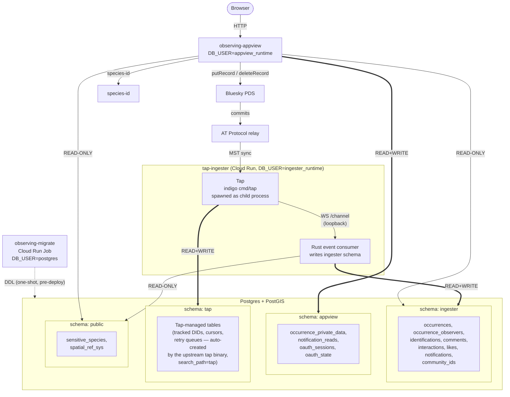

# Architecture

## System Overview


```mermaid
flowchart TB
    User([Browser])
    PDS[Bluesky PDS]
    Relay[AT Protocol relay]
    AV[observing-appview<br/>DB_USER=appview_runtime]

    subgraph TAPING["tap-ingester (Cloud Run, DB_USER=ingester_runtime)"]
      direction TB
      TAP[Tap<br/>indigo cmd/tap<br/>spawned as child process]
      TAPRS[Rust event consumer<br/>writes ingester schema]
      TAP -- "WS /channel<br/>(loopback)" --> TAPRS
    end

    MIG[observing-migrate<br/>Cloud Run Job<br/>DB_USER=postgres]
    SID[species-id]

    subgraph DB["Postgres + PostGIS"]
      direction LR
      subgraph ING["schema: ingester"]
        ING_TBL["occurrences, occurrence_observers,<br/>identifications, comments,<br/>interactions, likes, notifications,<br/>community_ids"]
      end
      subgraph APPV["schema: appview"]
        APPV_TBL["occurrence_private_data,<br/>notification_reads,<br/>oauth_sessions, oauth_state"]
      end
      subgraph TAP_SCHEMA["schema: tap"]
        TAP_TBL["Tap-managed tables<br/>(tracked DIDs, cursors,<br/>retry queues — auto-created<br/>by the upstream tap binary,<br/>search_path=tap)"]
      end
      subgraph PUB["schema: public"]
        PUB_TBL["sensitive_species,<br/>spatial_ref_sys"]
      end
    end

    User -- HTTP --> AV
    AV -- "putRecord / deleteRecord" --> PDS
    PDS -- commits --> Relay
    Relay -- "MST sync" --> TAP
    AV -- species-id --> SID

    TAPRS == "READ+WRITE" ==> ING
    TAP == "READ+WRITE" ==> TAP_SCHEMA
    TAPRS -- "READ-ONLY" --> PUB

    AV -- "READ-ONLY" --> ING
    AV == "READ+WRITE" ==> APPV
    AV -- "READ-ONLY" --> PUB

    MIG -. "DDL (one-shot, pre-deploy)" .-> DB
```

Writes to lexicon data flow **user → appview → PDS → Tap → tap-ingester → DB**. Tap (`indigo cmd/tap`) is bundled into the tap-ingester container and spawned as a child process; it does an MST/signature-verified sync against the user's PDS, then forwards events to the Rust consumer over a loopback WebSocket. Tap's own state — the tracked-DID list, cursor positions, and retry queues — lives in a dedicated `tap` schema on the same Cloud SQL instance the app uses, with `search_path=tap` so Tap's auto-created tables don't collide with anything else. The appview never writes to the `ingester` schema. OAuth state, private location, and per-user notification read-state live in the `appview` schema, where the appview has full CRUD. When a user marks a notification as read, the appview inserts into `appview.notification_reads` — at query time the notifications list LEFT JOINs against it to produce the `read` flag. Migrations run as a one-shot `observing-migrate` Cloud Run Job executed by CI *before* services are deployed; that job is the only thing that ever connects as the `postgres` superuser. No long-running service holds admin credentials — tap-ingester runs as `ingester_runtime` (CRUD on `ingester` schema, `USAGE`/`CREATE` on the `tap` schema for Tap's own tables, `SELECT` on `public.sensitive_species`) and the appview runs as `appview_runtime`.

## Project Structure

Top-level service crates (each builds a deployable binary):

```
crates/
├── observing-appview/      # Unified REST API + OAuth + media cache + taxonomy + static serving (Rust/Axum)
├── tap-ingester/           # AT Protocol firehose consumer; bundles + spawns the upstream `tap` Go binary (Rust)
├── observing-migrate/      # One-shot DB migration runner (Cloud Run Job)
└── observing-species-id/   # BioCLIP photo → species identification service (Rust + ONNX)

frontend/                   # Web UI (Vite + React + MapLibre GL)
```

Supporting library crates (not separately deployed) are omitted for brevity — see `Cargo.toml` for the full workspace.

## Components

### Lexicons (`lexicons-src/` → `lexicons/`)

Darwin Core compliant schemas for biodiversity data following [TDWG standards](https://dwc.tdwg.org/).

Schemas are authored in [MLF](https://mlf.lol) ("Matt's Lexicon Format"), a
human-friendly DSL for ATProto lexicons. The `.mlf` files in `lexicons-src/`
are the source of truth; `lexicons/*.json` (consumed by the frontend's
`LexiconView` and the Docker image) and the `observing-lexicons` Rust crate are
both generated from them via `npm run generate-lexicons`. See
[CONTRIBUTING.md](../CONTRIBUTING.md#lexicon-changes).

- `bio.lexicons.temp.v0-1.occurrence` - Occurrence records
- `bio.lexicons.temp.v0-1.identification` - Taxonomic determinations
- `bio.lexicons.temp.v0-1.media` - Image records referenced by occurrences (resolved on demand, not firehose-indexed)
- `ing.observ.temp.comment` - Discussion comments
- `ing.observ.temp.interaction` - Species interactions
- `ing.observ.temp.like` - Likes

### AppView (`crates/observing-appview/`)

Unified Rust/Axum server handling all backend concerns:

- **REST API** - Occurrences, identifications, comments, feeds, profiles, taxonomy, interactions, likes
- **OAuth** - AT Protocol authentication via `atrium-oauth`
- **AT Protocol Client** - Record create/update/delete, blob upload via internal RPC
- **Media Cache** - In-process blob/thumbnail cache served at `/media/{blob,thumb}/{did}/{cid}` (filesystem-backed, LRU)
- **Taxonomy Resolver** - In-process GBIF + Wikidata lookups served at `/api/taxa/*` (moka in-memory cache)
- **Static Files** - Serves the built React frontend
- **Data Enrichment** - Profile resolution, community IDs, image URLs, effective taxonomy
- **Record Processing** - Uses shared `observing-db` processing module for consistent record-to-DB conversion

### Tap-Ingester (`crates/tap-ingester/`)

Rust service driven by [Tap](https://github.com/bluesky-social/indigo/tree/main/cmd/tap), the official AT Protocol verified-sync utility. Tap is bundled into the container image and spawned as a child process; tap-ingester talks to it over loopback WebSocket.

- **Firehose** - Tap subscribes to the AT Protocol relay, performs MST + signature verification per commit, and re-emits clean events to tap-ingester via the `tapped` Rust client
- **Event Processing** - Handles occurrence, identification, comment, interaction, and like records
- **Tap state** - Tap manages its own tracked-DID list, cursors, and retry queues in the dedicated `tap` Postgres schema (persistent across deploys)
- **HTTP surface** - `/` serves a combined ingester + Tap status dashboard; `/api/stats` and `/api/tap-stats` expose JSON; `/health` is the Cloud Run liveness probe
- **Record Processing** - Uses shared `observing-db` processing module (same conversion logic as appview)
- **Built with** - Tokio, SQLx, `tapped`

### Frontend (`frontend/`)

Vite + React SPA.

- **Map** - MapLibre GL with clustered occurrence markers
- **Uploader** - Photo capture, EXIF extraction, occurrence submission
- **Identification** - Agree/Suggest ID interface

## Key Files

- `lexicons-src/` - Lexicon source of truth, authored in MLF (`.mlf`)
- `lexicons/` - Generated AT Protocol JSON lexicon definitions
- `crates/observing-appview/src/routes/` - REST API endpoint handlers
- `crates/observing-appview/src/enrichment.rs` - Response enrichment (profiles, community IDs)
- `crates/observing-db/src/` - PostgreSQL + PostGIS database layer
- `crates/observing-db/src/processing.rs` - Shared record conversion (AT Protocol JSON → DB params)
- `crates/observing-appview/src/routes/oauth.rs` - OAuth authentication
- `scripts/generate-lexicons.sh` - MLF → JSON → Rust pipeline driver (mlf + jacquard-codegen)
- `scripts/generate-rust-types.sh` - JSON lexicon → Rust type generator (jacquard-codegen)
- `cloudbuild.yaml` - Multi-service Cloud Build config

## Database Tables

Tables live in owner-labeled schemas (`ingester`, `appview`, `public`). Unqualified references resolve via a database-wide `search_path = ingester, appview, public`.

### Ingester-owned (schema `ingester`)

| Table | Description | Written By | Read By |
|-------|-------------|------------|---------|
| `occurrences` | Biodiversity observations | Ingester | AppView |
| `identifications` | Taxonomic determinations | Ingester | AppView |
| `comments` | Discussion on observations | Ingester | AppView |
| `likes` | Observation likes | Ingester | AppView |
| `interactions` | Species interactions | Ingester | AppView |
| `occurrence_observers` | Co-observer relationships | Ingester | AppView |
| `notifications` | Event notifications (ID / comment / like on your observation) | Ingester | AppView (SELECT + UPDATE on `read`) |
| `community_ids` (matview) | Consensus taxonomy per occurrence | Ingester (REFRESH) | AppView |

### Tap-owned (schema `tap`)

Tap (`indigo cmd/tap`) creates and manages its own tables here on first connect; tap-ingester only has `USAGE` + `CREATE` on the schema, not on individual tables. Tables aren't enumerated explicitly because Tap's schema is its internal contract — treat the schema as a black box.

| Table set | Description | Written By | Read By |
|-----------|-------------|------------|---------|
| Tap-managed | Tracked DIDs, firehose cursor, retry/resync queues, repo metadata | Tap | Tap |

### AppView-owned (schema `appview`)

| Table | Description | Written By | Read By |
|-------|-------------|------------|---------|
| `occurrence_private_data` | Exact coordinates (geoprivacy) | AppView | AppView |
| `notification_reads` | Per-user read-state for notifications | AppView | AppView |
| `oauth_sessions` | Persistent user sessions | AppView | AppView |
| `oauth_state` | Temporary PKCE flow state | AppView | AppView |

### Shared reference (schema `public`)

| Table | Description | Written By | Read By |
|-------|-------------|------------|---------|
| `sensitive_species` | Auto-obscuration rules | (manual / migrations) | AppView, Ingester |
| `spatial_ref_sys` | PostGIS spatial reference systems | (PostGIS extension) | All |

## Data Lifecycles

### Creating an Observation

```
1. User fills form in frontend
   │
   ▼
2. Frontend POST /api/occurrences → AppView
   │
   ├─▶ Validate OAuth session
   ├─▶ Validate taxonomy (in-process GBIF + Wikidata)
   ├─▶ Reverse geocode coordinates (Nominatim)
   ├─▶ Upload each image as a bio.lexicons.temp.v0-1.media record on the user's PDS
   │
   ▼
3. AppView creates the bio.lexicons.temp.v0-1.occurrence record on the user's PDS
   │  createRecord({ collection: "bio.lexicons.temp.v0-1.occurrence",
   │                 record: { ..., associatedMedia: [ strongRefs ] } })
   │
   ├─▶ Writes exact coords to `appview.occurrence_private_data`
   │
   ▼
4. PDS commit hits the AT Protocol relay
   │
   ▼
5. Tap (embedded in tap-ingester) verifies the commit
   │
   ├─▶ MST proof check
   ├─▶ Signature check
   ├─▶ Filters to configured collections
   │
   ▼
6. tap-ingester receives a verified `RecordEvent`
   │
   ├─▶ UPSERT to `ingester.occurrences`
   ├─▶ SYNC `ingester.occurrence_observers`
   │
   ▼
7. Data now queryable via API
```

### Adding an Identification

```
1. User submits ID in frontend
   │
   ▼
2. Frontend POST /api/identifications → AppView
   │
   ├─▶ Validate OAuth session
   ├─▶ Validate taxonomy
   │
   ▼
3. AppView creates AT Protocol record on user's PDS
   │  createRecord({ collection: "bio.lexicons.temp.v0-1.identification", ... })
   │
   ▼
4. PDS commit → relay → Tap (verify) → tap-ingester
   │
   ├─▶ If subject occurrence belongs to a DID Tap isn't yet tracking,
   │   tap-ingester POSTs `/repos/add` and skips the ack so the record
   │   is redelivered after Tap finishes the cross-repo backfill
   ├─▶ UPSERT to `ingester.identifications`
   ├─▶ INSERT into `ingester.notifications` (unless self-ID)
   │
   ▼
5. Community ID recalculated on next matview refresh
```

### Marking a Notification as Read

Notification creation is ingester-owned; read-state is appview-owned.

```
1. User views notifications → AppView SELECTs from
   ingester.notifications LEFT JOIN appview.notification_reads
   (produces the `read` flag).

2. User clicks "mark read" → AppView INSERTs into
   appview.notification_reads. No write to ingester schema.
```

### Firehose Ingestion

```
AT Protocol relay
   │
   ▼
Tap (indigo cmd/tap, child process inside tap-ingester container)
   │  signal_collection: bio.lexicons.temp.v0-1.occurrence
   │  collection_filters:
   │    - bio.lexicons.temp.v0-1.occurrence
   │    - bio.lexicons.temp.v0-1.identification
   │    - ing.observ.temp.comment
   │    - ing.observ.temp.interaction
   │    - ing.observ.temp.like
   │
   │  per commit:
   │    - MST inclusion proof check
   │    - signature check
   │    - cross-repo backfill on previously-unknown DIDs
   │
   ▼
Loopback WebSocket (tapped::TapClient)
   │
   ▼
┌─────────────────────────────────────────────────────┐
│ RecordEvent { did, collection, rkey, cid, action,  │
│               record_as_str() }                     │
└─────────────────────────────────────────────────────┘
   │
   ├─▶ Create / Update → UPSERT row
   ├─▶ Delete           → DELETE row (cascades)
   │
   ▼
Cursor + tracked-DID list persist in schema `tap` (Postgres);
no client-side cursor saving from tap-ingester.
```

## Community Identification

Consensus algorithm similar to iNaturalist:

- **Research Grade**: 2+ identifications with 2/3 majority on species
- **Needs ID**: Has identifications but no consensus
- **Casual**: No identifications yet

Calculated in real-time, stored in a materialized view.

## Geoprivacy

Exact coordinates are stored separately from public data:

| Table | Contains | Visibility |
|-------|----------|------------|
| `ingester.occurrences.location` | Potentially obscured point | Public |
| `appview.occurrence_private_data.location` | Exact coordinates | Owner + co-observers only |

Obscuration rules:
- `geoprivacy = 'open'` → Exact location in both tables
- `geoprivacy = 'obscured'` → Random offset in public, exact in private
- `geoprivacy = 'private'` → No public location
- Sensitive species → Auto-obscured based on `public.sensitive_species`

## Cascade Deletes

When an occurrence is deleted:

```
DELETE ingester.occurrences WHERE uri = '...'
  └─▶ CASCADE DELETE ingester.identifications WHERE subject_uri = '...'
  └─▶ CASCADE DELETE ingester.comments WHERE subject_uri = '...'
  └─▶ CASCADE DELETE ingester.likes WHERE subject_uri = '...'
  └─▶ CASCADE DELETE ingester.interactions WHERE subject_a/b_occurrence_uri = '...'
  └─▶ CASCADE DELETE ingester.occurrence_observers WHERE occurrence_uri = '...'
  └─▶ CASCADE DELETE appview.occurrence_private_data WHERE occurrence_uri = '...'
```

## Data Ownership

Unlike centralized platforms, data is stored on users' Personal Data Servers (PDS):

- **Your data, your server** - Observations are AT Protocol records you control
- **Portable** - Move your data between PDS providers
- **Interoperable** - Darwin Core standards for scientific use
- **Federated** - No single point of failure
