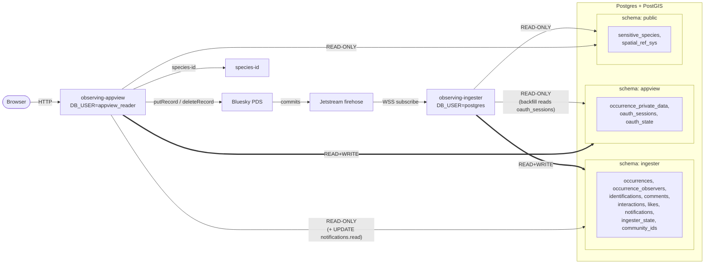

# Architecture

## System Overview


```mermaid
flowchart LR
    User([Browser])
    PDS[Bluesky PDS]
    JS[Jetstream firehose]
    AV[observing-appview<br/>DB_USER=appview_reader]
    IG[observing-ingester<br/>DB_USER=postgres]
    SID[species-id]

    subgraph DB["Postgres + PostGIS"]
      direction TB
      subgraph ING["schema: ingester"]
        ING_TBL["occurrences, occurrence_observers,<br/>identifications, comments,<br/>interactions, likes, notifications,<br/>ingester_state, community_ids"]
      end
      subgraph APPV["schema: appview"]
        APPV_TBL["occurrence_private_data,<br/>oauth_sessions, oauth_state"]
      end
      subgraph PUB["schema: public"]
        PUB_TBL["sensitive_species,<br/>spatial_ref_sys"]
      end
    end

    User -- HTTP --> AV
    AV -- "putRecord / deleteRecord" --> PDS
    PDS -- commits --> JS
    JS -- "WSS subscribe" --> IG
    AV -- species-id --> SID

    IG == "READ+WRITE" ==> ING
    IG -- "READ-ONLY<br/>(backfill reads oauth_sessions)" --> APPV
    IG -- "READ-ONLY" --> PUB

    AV -- "READ-ONLY<br/>(+ UPDATE notifications.read)" --> ING
    AV == "READ+WRITE" ==> APPV
    AV -- "READ-ONLY" --> PUB
```

Writes to lexicon data flow **user → appview → PDS → Jetstream → ingester → DB**; the appview never writes to the `ingester` schema directly (except to flip `notifications.read`). OAuth state and private location live in the `appview` schema, where the appview has full CRUD. The ingester runs as the `postgres` role — it owns migrations, so it has full access to every schema at the grant level, but in practice only writes its own schema (plus `public.sensitive_species` during seeding, and read access to `appview.oauth_sessions` during backfill).

## Project Structure

```
crates/
├── observing-appview/     # Unified REST API + OAuth + media cache + taxonomy + static serving (Rust/Axum)
├── observing-db/          # Shared database layer (Rust)
├── observing-geocoding/   # Nominatim reverse geocoding (Rust)
├── observing-identity/    # DID/handle resolution + profile caching (Rust)
├── observing-ingester/    # AT Protocol firehose consumer (Rust)
├── observing-lexicons/    # Generated AT Protocol record types (Rust)
└── gbif-api/              # GBIF API client (Rust)

frontend/                  # Web UI (Vite + React + MapLibre GL)
```

## Components

### Lexicons (`lexicons/`)

Darwin Core compliant schemas for biodiversity data following [TDWG standards](https://dwc.tdwg.org/):

- `bio.lexicons.temp.occurrence` - Occurrence records
- `bio.lexicons.temp.identification` - Taxonomic determinations
- `ing.observ.temp.comment` - Discussion comments
- `ing.observ.temp.interaction` - Species interactions
- `ing.observ.temp.like` - Likes

### AppView (`crates/observing-appview/`)

Unified Rust/Axum server handling all backend concerns:

- **REST API** - Occurrences, identifications, comments, feeds, profiles, taxonomy, interactions, likes
- **OAuth** - AT Protocol authentication via `atrium-oauth`
- **AT Protocol Client** - Record create/update/delete, blob upload via internal RPC
- **Media Cache** - In-process blob/thumbnail cache served at `/media/{blob,thumb}/{did}/{cid}` (filesystem-backed, LRU)
- **Taxonomy Resolver** - In-process GBIF + Wikidata lookups served at `/api/taxa/*` (moka in-memory cache)
- **Static Files** - Serves the built React frontend
- **Data Enrichment** - Profile resolution, community IDs, image URLs, effective taxonomy
- **Record Processing** - Uses shared `observing-db` processing module for consistent record-to-DB conversion

### Ingester (`crates/observing-ingester/`)

Rust service that monitors the AT Protocol firehose.

- **Firehose** - WebSocket client subscribing to the AT Protocol relay
- **Event Processing** - Handles occurrence, identification, comment, interaction, and like records
- **Record Processing** - Uses shared `observing-db` processing module (same conversion logic as appview)
- **Built with** - Tokio, SQLx

### Frontend (`frontend/`)

Vite + React SPA.

- **Map** - MapLibre GL with clustered occurrence markers
- **Uploader** - Photo capture, EXIF extraction, occurrence submission
- **Identification** - Agree/Suggest ID interface

## Key Files

- `lexicons/` - AT Protocol lexicon definitions
- `crates/observing-appview/src/routes/` - REST API endpoint handlers
- `crates/observing-appview/src/enrichment.rs` - Response enrichment (profiles, community IDs)
- `crates/observing-db/src/` - PostgreSQL + PostGIS database layer
- `crates/observing-db/src/processing.rs` - Shared record conversion (AT Protocol JSON → DB params)
- `crates/observing-appview/src/routes/oauth.rs` - OAuth authentication
- `scripts/generate-rust-types.sh` - Lexicon → Rust type generator (jacquard-codegen)
- `cloudbuild.yaml` - Multi-service Cloud Build config

## Community Identification

Consensus algorithm similar to iNaturalist:

- **Research Grade**: 2+ identifications with 2/3 majority on species
- **Needs ID**: Has identifications but no consensus
- **Casual**: No identifications yet

Calculated in real-time, stored in a materialized view.

## Data Ownership

Unlike centralized platforms, data is stored on users' Personal Data Servers (PDS):

- **Your data, your server** - Observations are AT Protocol records you control
- **Portable** - Move your data between PDS providers
- **Interoperable** - Darwin Core standards for scientific use
- **Federated** - No single point of failure
