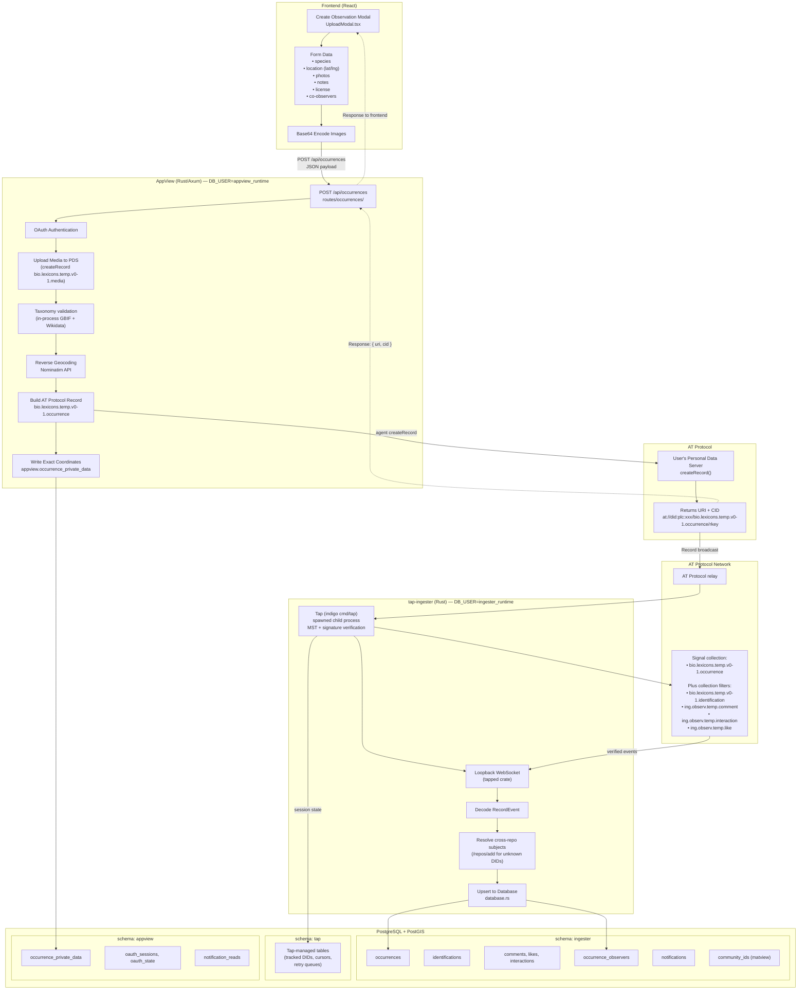

# Data Flow & Database Access

This document describes how data flows through the Observ.ing system and which services access which database tables.

> **Companion doc:** see `architecture.md` for the higher-level service topology and role/privilege model. This doc focuses on how records move end-to-end and which service is allowed to write what.

## Architecture Overview


```mermaid
flowchart TB
    subgraph Frontend["Frontend (React)"]
        Modal["Create Observation Modal<br/>UploadModal.tsx"]
        FormData["Form Data<br/>• species<br/>• location (lat/lng)<br/>• photos<br/>• notes<br/>• license<br/>• co-observers"]
        Base64["Base64 Encode Images"]
        Modal --> FormData --> Base64
    end

    subgraph AppView["AppView (Rust/Axum) — DB_USER=appview_runtime"]
        API["POST /api/occurrences<br/>routes/occurrences/"]
        Auth["OAuth Authentication"]
        BlobUpload["Upload Media to PDS<br/>(createRecord bio.lexicons.temp.v0-1.media)"]
        GBIF["Taxonomy validation<br/>(in-process GBIF + Wikidata)"]
        Geocode["Reverse Geocoding<br/>Nominatim API"]
        BuildRecord["Build AT Protocol Record<br/>bio.lexicons.temp.v0-1.occurrence"]
        PrivateData["Write Exact Coordinates<br/>appview.occurrence_private_data"]
    end

    subgraph ATProtocol["AT Protocol"]
        PDS["User's Personal Data Server<br/>createRecord()"]
        URI["Returns URI + CID<br/>at://did:plc:xxx/bio.lexicons.temp.v0-1.occurrence/rkey"]
    end

    subgraph Firehose["AT Protocol Network"]
        Relay["AT Protocol relay"]
        Filter["Signal collection:<br/>• bio.lexicons.temp.v0-1.occurrence<br/><br/>Plus collection filters:<br/>• bio.lexicons.temp.v0-1.identification<br/>• ing.observ.temp.comment<br/>• ing.observ.temp.interaction<br/>• ing.observ.temp.like"]
    end

    subgraph TapIng["tap-ingester (Rust) — DB_USER=ingester_runtime"]
        Tap["Tap (indigo cmd/tap)<br/>spawned child process<br/>MST + signature verification"]
        WS["Loopback WebSocket<br/>(tapped crate)"]
        Parse["Decode RecordEvent"]
        Resolve["Resolve cross-repo subjects<br/>(/repos/add for unknown DIDs)"]
        Upsert["Upsert to Database<br/>database.rs"]
        Tap --> WS
    end

    subgraph Database["PostgreSQL + PostGIS"]
        subgraph IngSchema["schema: ingester"]
            Occurrences["occurrences"]
            Identifications["identifications"]
            Comments["comments, likes, interactions"]
            Observers["occurrence_observers"]
            Notifications["notifications"]
            Matview["community_ids (matview)"]
        end
        subgraph TapSchema["schema: tap"]
            TapState["Tap-managed tables<br/>(tracked DIDs, cursors,<br/>retry queues)"]
        end
        subgraph AppvSchema["schema: appview"]
            PrivData["occurrence_private_data"]
            OauthTbls["oauth_sessions, oauth_state"]
            NotifReads["notification_reads"]
        end
    end

    %% Main flow
    Base64 -->|"POST /api/occurrences<br/>JSON payload"| API
    API --> Auth
    Auth --> BlobUpload
    BlobUpload --> GBIF
    GBIF --> Geocode
    Geocode --> BuildRecord
    BuildRecord -->|"agent createRecord"| PDS
    BuildRecord --> PrivateData
    PrivateData --> PrivData
    PDS --> URI
    URI -->|"Record broadcast"| Relay
    Relay --> Tap
    Tap --> Filter
    Filter -->|"verified events"| WS
    WS --> Parse
    Parse --> Resolve
    Resolve --> Upsert
    Upsert --> Occurrences
    Upsert --> Observers
    Tap -- "session state" --> TapState

    %% Response flow
    URI -.->|"Response: { uri, cid }"| API
    API -.->|"Response to frontend"| Modal
```

**Key insight:** Lexicon writes flow **user → appview → PDS → Tap → tap-ingester → DB**. Tap (`indigo cmd/tap`, bundled into the tap-ingester container) does MST + signature verification per commit before forwarding to the Rust consumer. The appview holds no write grant on the `ingester` schema — enforced at the DB layer via role grants (see `20260418000000_appview_reader_grants.sql`).

**Tap's own state** (tracked DIDs, cursor positions, retry queues) lives in the dedicated `tap` schema on the same Postgres instance, with `search_path=tap`. State is persistent across deploys, so Tap doesn't re-backfill every active DID on restart.

**Visibility latency:** The appview does *not* do a direct-insert bypass for immediate visibility. Freshly created occurrences become queryable once the firehose event round-trips through Tap → tap-ingester → DB (typically sub-second).

**Shared record processing:** Both the appview (when building a record) and the ingester (when indexing one) use the shared `observing_db::processing` module to convert AT Protocol record JSON into database params, ensuring consistent field mapping.

### Key Files

| Component | File |
|-----------|------|
| Create Modal | `frontend/src/components/modals/UploadModal.tsx` |
| Occurrence Routes | `crates/observing-appview/src/routes/occurrences/` |
| OAuth Routes | `crates/observing-appview/src/routes/oauth.rs` |
| Data Enrichment | `crates/observing-appview/src/enrichment.rs` |
| Ingester | `crates/tap-ingester/` |
| Tap Rust client | `tapped` (crates.io) |
| Cross-repo resolver | `crates/tap-ingester/src/subject_resolver.rs` |
| Status dashboard | `crates/tap-ingester/src/dashboard.rs` |
| Shared DB Layer | `crates/observing-db/src/` |
| Shared Record Processing | `crates/observing-db/src/processing.rs` |

### Data Transformations by Stage

| Stage | Input | Output | Transformation |
|-------|-------|--------|----------------|
| Frontend | User form input + files | JSON + Base64 images | Image encoding, form serialization |
| AppView | JSON request | AT Protocol record | Media record creation on PDS, GBIF lookup, geocoding, shared record processing |
| PDS | Record JSON | URI + CID | Cryptographic signing, storage |
| Tap | Relay commits | Verified `RecordEvent` stream | MST proof check, signature check, collection filtering |
| tap-ingester | `RecordEvent` | SQL statements | Cross-repo subject resolution (`/repos/add` for unknown DIDs), shared record processing, upsert |
| Database | SQL | Stored rows | PostGIS point encoding, indexing |

## Services

| Service | Port | Role | DB Role |
|---------|------|------|---------|
| **AppView** (`observing-appview`) | 3000 | REST API, OAuth, AT Protocol client, media cache, taxonomy, frontend static files | `appview_runtime` |
| **Tap-Ingester** (`tap-ingester`) | 8080 | Verified-sync firehose consumer; bundles + spawns the upstream `tap` Go binary | `ingester_runtime` (CRUD on `ingester` schema, `USAGE`/`CREATE` on `tap` schema) |
| **Species-ID** (`observing-species-id`) | 3005 | BioCLIP photo → species inference | none |
| **Migrate** (`observing-migrate`) | — (one-shot Cloud Run Job) | Runs `sqlx` migrations before service deploys | `postgres` (admin) |

Media caching and GBIF/Wikidata taxonomy lookups are in-process inside the appview — there are no separate media-proxy or taxonomy services.

## Database Tables

Tables live in owner-labeled schemas (`ingester`, `appview`, `public`). Unqualified references resolve via a database-wide `search_path = ingester, appview, public`.

### Ingester-owned (schema `ingester`)

| Table | Description | Written By | Read By |
|-------|-------------|------------|---------|
| `occurrences` | Biodiversity observations | Ingester | AppView |
| `identifications` | Taxonomic determinations | Ingester | AppView |
| `comments` | Discussion on observations | Ingester | AppView |
| `likes` | Observation likes | Ingester | AppView |
| `interactions` | Species interactions | Ingester | AppView |
| `occurrence_observers` | Co-observer relationships | Ingester | AppView |
| `notifications` | Event notifications (ID / comment / like on your observation) | Ingester | AppView (SELECT + UPDATE on `read`) |
| `community_ids` (matview) | Consensus taxonomy per occurrence | Ingester (REFRESH) | AppView |

### Tap-owned (schema `tap`)

Tap (`indigo cmd/tap`) creates and manages its own tables here on first connect; tap-ingester only has `USAGE` + `CREATE` on the schema, not on individual tables. Tables aren't enumerated explicitly because Tap's schema is its internal contract — treat the schema as a black box.

| Table set | Description | Written By | Read By |
|-----------|-------------|------------|---------|
| Tap-managed | Tracked DIDs, firehose cursor, retry/resync queues, repo metadata | Tap | Tap |

### AppView-owned (schema `appview`)

| Table | Description | Written By | Read By |
|-------|-------------|------------|---------|
| `occurrence_private_data` | Exact coordinates (geoprivacy) | AppView | AppView |
| `notification_reads` | Per-user read-state for notifications | AppView | AppView |
| `oauth_sessions` | Persistent user sessions | AppView | AppView |
| `oauth_state` | Temporary PKCE flow state | AppView | AppView |

### Shared reference (schema `public`)

| Table | Description | Written By | Read By |
|-------|-------------|------------|---------|
| `sensitive_species` | Auto-obscuration rules | (manual / migrations) | AppView, Ingester |
| `spatial_ref_sys` | PostGIS spatial reference systems | (PostGIS extension) | All |

## Data Lifecycles

### Creating an Observation

```
1. User fills form in frontend
   │
   ▼
2. Frontend POST /api/occurrences → AppView
   │
   ├─▶ Validate OAuth session
   ├─▶ Validate taxonomy (in-process GBIF + Wikidata)
   ├─▶ Reverse geocode coordinates (Nominatim)
   ├─▶ Upload each image as a bio.lexicons.temp.v0-1.media record on the user's PDS
   │
   ▼
3. AppView creates the bio.lexicons.temp.v0-1.occurrence record on the user's PDS
   │  createRecord({ collection: "bio.lexicons.temp.v0-1.occurrence",
   │                 record: { ..., associatedMedia: [ strongRefs ] } })
   │
   ├─▶ Writes exact coords to `appview.occurrence_private_data`
   │
   ▼
4. PDS commit hits the AT Protocol relay
   │
   ▼
5. Tap (embedded in tap-ingester) verifies the commit
   │
   ├─▶ MST proof check
   ├─▶ Signature check
   ├─▶ Filters to configured collections
   │
   ▼
6. tap-ingester receives a verified `RecordEvent`
   │
   ├─▶ UPSERT to `ingester.occurrences`
   ├─▶ SYNC `ingester.occurrence_observers`
   │
   ▼
7. Data now queryable via API
```

### Adding an Identification

```
1. User submits ID in frontend
   │
   ▼
2. Frontend POST /api/identifications → AppView
   │
   ├─▶ Validate OAuth session
   ├─▶ Validate taxonomy
   │
   ▼
3. AppView creates AT Protocol record on user's PDS
   │  createRecord({ collection: "bio.lexicons.temp.v0-1.identification", ... })
   │
   ▼
4. PDS commit → relay → Tap (verify) → tap-ingester
   │
   ├─▶ If subject occurrence belongs to a DID Tap isn't yet tracking,
   │   tap-ingester POSTs `/repos/add` and skips the ack so the record
   │   is redelivered after Tap finishes the cross-repo backfill
   ├─▶ UPSERT to `ingester.identifications`
   ├─▶ INSERT into `ingester.notifications` (unless self-ID)
   │
   ▼
5. Community ID recalculated on next matview refresh
```

### Marking a Notification as Read

Notification creation is ingester-owned; read-state is appview-owned.

```
1. User views notifications → AppView SELECTs from
   ingester.notifications LEFT JOIN appview.notification_reads
   (produces the `read` flag).

2. User clicks "mark read" → AppView INSERTs into
   appview.notification_reads. No write to ingester schema.
```

### Firehose Ingestion

```
AT Protocol relay
   │
   ▼
Tap (indigo cmd/tap, child process inside tap-ingester container)
   │  signal_collection: bio.lexicons.temp.v0-1.occurrence
   │  collection_filters:
   │    - bio.lexicons.temp.v0-1.occurrence
   │    - bio.lexicons.temp.v0-1.identification
   │    - ing.observ.temp.comment
   │    - ing.observ.temp.interaction
   │    - ing.observ.temp.like
   │
   │  per commit:
   │    - MST inclusion proof check
   │    - signature check
   │    - cross-repo backfill on previously-unknown DIDs
   │
   ▼
Loopback WebSocket (tapped::TapClient)
   │
   ▼
┌─────────────────────────────────────────────────────┐
│ RecordEvent { did, collection, rkey, cid, action,  │
│               record_as_str() }                     │
└─────────────────────────────────────────────────────┘
   │
   ├─▶ Create / Update → UPSERT row
   ├─▶ Delete           → DELETE row (cascades)
   │
   ▼
Cursor + tracked-DID list persist in schema `tap` (Postgres);
no client-side cursor saving from tap-ingester.
```

## Write Patterns by Service

### AppView writes

| Operation | Schema.Table | Trigger |
|-----------|--------------|---------|
| INSERT/UPDATE | `appview.oauth_state` | OAuth login flow |
| INSERT/UPDATE/DELETE | `appview.oauth_sessions` | Login / logout |
| INSERT/UPDATE | `appview.occurrence_private_data` | Create / update observation |
| INSERT | `appview.notification_reads` | User marks notification read |

The appview holds **no write grant** on the `ingester` schema — enforced at the DB layer.

### tap-ingester writes

| Operation | Schema.Table | Trigger |
|-----------|--------------|---------|
| UPSERT | `ingester.occurrences` | Firehose occurrence event |
| UPSERT | `ingester.identifications` | Firehose identification event |
| UPSERT | `ingester.comments` | Firehose comment event |
| UPSERT | `ingester.interactions` | Firehose interaction event |
| UPSERT | `ingester.likes` | Firehose like event |
| SYNC | `ingester.occurrence_observers` | Firehose occurrence with `recordedBy` |
| INSERT | `ingester.notifications` | On ID / comment / like where the actor ≠ occurrence owner |
| DELETE | `ingester.*` | Firehose delete event (cascades) |
| REFRESH | `ingester.community_ids` | Periodic matview refresh |
| (managed by Tap) | `tap.*` | Tap's internal state (DID tracking, cursor, retry queues) |

## Read Patterns

### Spatial Queries (PostGIS)

```sql
-- Nearby occurrences
SELECT * FROM occurrences
WHERE ST_DWithin(location, ST_MakePoint(lng, lat)::geography, radius_meters);

-- Bounding box for map
SELECT * FROM occurrences
WHERE location && ST_MakeEnvelope(minLng, minLat, maxLng, maxLat, 4326);
```

### Feed Queries

```sql
-- Recent observations
SELECT * FROM occurrences
ORDER BY indexed_at DESC
LIMIT 20;

-- User's observations
SELECT * FROM occurrences
WHERE did = 'did:plc:...'
ORDER BY event_date DESC;
```

### Community ID Calculation

```sql
-- Get consensus taxonomy for an occurrence
SELECT scientific_name, COUNT(*) as votes
FROM identifications
WHERE subject_uri = 'at://...'
GROUP BY scientific_name, kingdom
ORDER BY votes DESC
LIMIT 1;
```

## Geoprivacy

Exact coordinates are stored separately from public data:

| Table | Contains | Visibility |
|-------|----------|------------|
| `ingester.occurrences.location` | Potentially obscured point | Public |
| `appview.occurrence_private_data.location` | Exact coordinates | Owner + co-observers only |

Obscuration rules:
- `geoprivacy = 'open'` → Exact location in both tables
- `geoprivacy = 'obscured'` → Random offset in public, exact in private
- `geoprivacy = 'private'` → No public location
- Sensitive species → Auto-obscured based on `public.sensitive_species`

## Cascade Deletes

When an occurrence is deleted:

```
DELETE ingester.occurrences WHERE uri = '...'
  └─▶ CASCADE DELETE ingester.identifications WHERE subject_uri = '...'
  └─▶ CASCADE DELETE ingester.comments WHERE subject_uri = '...'
  └─▶ CASCADE DELETE ingester.likes WHERE subject_uri = '...'
  └─▶ CASCADE DELETE ingester.interactions WHERE subject_a/b_occurrence_uri = '...'
  └─▶ CASCADE DELETE ingester.occurrence_observers WHERE occurrence_uri = '...'
  └─▶ CASCADE DELETE appview.occurrence_private_data WHERE occurrence_uri = '...'
```

## Connection Details

All services use the same PostgreSQL instance, but connect as different Postgres roles:

```
Database: observing
Extensions: PostGIS
Connection pool: max 10

Environment variables (both services):
- DATABASE_URL (full connection string)
- or DB_HOST, DB_NAME, DB_USER, DB_PASSWORD (Cloud SQL style)
```

**Migrations are not run by long-running services.** They're applied by a dedicated `observing-migrate` Cloud Run Job that runs pre-deploy in CI (see `.github/workflows/ci.yml`). The migrate Job is the only thing that ever connects as `postgres`.
