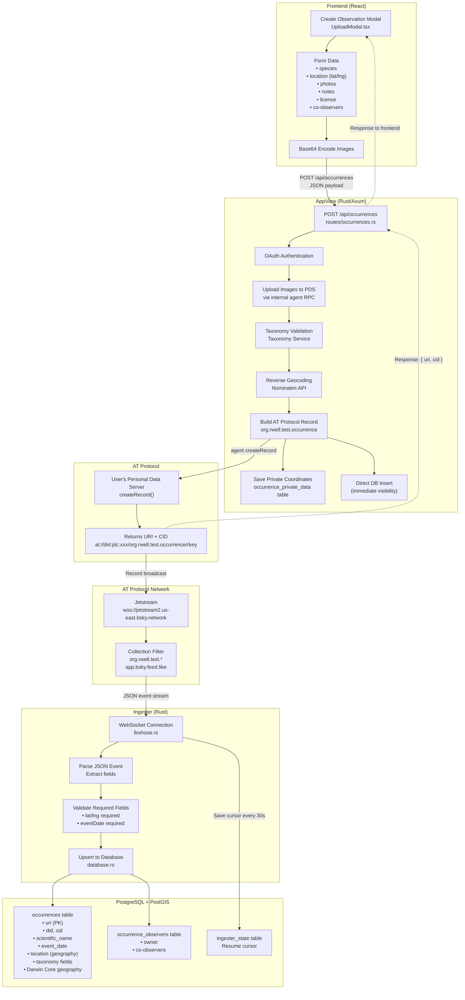

# Data Flow & Database Access

This document describes how data flows through the Observ.ing system and which services access which database tables.

## Architecture Overview



**Key insight**: Writes go through AT Protocol (user's PDS), then get indexed via the firehose. The appview also does a direct DB insert for immediate visibility (bypasses ingester latency). Reads come directly from PostgreSQL.

### Key Files

| Component | File |
|-----------|------|
| Create Modal | `frontend/src/components/modals/UploadModal.tsx` |
| Occurrence Routes | `crates/observing-appview/src/routes/occurrences.rs` |
| OAuth Routes | `crates/observing-appview/src/routes/oauth.rs` |
| Data Enrichment | `crates/observing-appview/src/enrichment.rs` |
| Firehose | `crates/observing-ingester/src/firehose.rs` |
| Ingester DB Ops | `crates/observing-ingester/src/database.rs` |
| Shared DB Layer | `crates/observing-db/src/` |

### Data Transformations by Stage

| Stage | Input | Output | Transformation |
|-------|-------|--------|----------------|
| Frontend | User form input + files | JSON + Base64 images | Image encoding, form serialization |
| AppView | JSON request | AT Protocol record | Blob upload, GBIF lookup, geocoding |
| PDS | Record JSON | URI + CID | Cryptographic signing, storage |
| Jetstream | PDS events | Filtered JSON stream | Collection filtering |
| Ingester | JSON events | SQL statements | Field extraction, validation |
| Database | SQL | Stored rows | PostGIS point encoding, indexing |

## Services

| Service | Port | Role | DB Access |
|---------|------|------|-----------|
| **AppView** | 3000 | REST API, OAuth, AT Protocol client, static files | Read/Write |
| **Ingester** | 8080 | Firehose consumer, indexes records | Write-heavy |
| **Media Proxy** | 3001 | Image caching | None |
| **Taxonomy** | 3003 | GBIF taxonomy lookups | None |

## Database Tables

### Core Data Tables

| Table | Description | Written By | Read By |
|-------|-------------|------------|---------|
| `occurrences` | Biodiversity observations | Ingester, AppView | AppView |
| `identifications` | Taxonomic determinations | Ingester, AppView | AppView |
| `comments` | Discussion on observations | Ingester, AppView | AppView |
| `likes` | Observation likes | Ingester, AppView | AppView |
| `interactions` | Species interactions | Ingester, AppView | AppView |
| `occurrence_observers` | Co-observer relationships | Ingester, AppView | AppView |
| `occurrence_private_data` | Exact coordinates (geoprivacy) | AppView | AppView |
| `sensitive_species` | Auto-obscuration rules | (manual) | AppView |

### Infrastructure Tables

| Table | Description | Written By | Read By |
|-------|-------------|------------|---------|
| `ingester_state` | Firehose cursor position | Ingester | Ingester |
| `oauth_state` | Temporary PKCE flow state | AppView | AppView |
| `oauth_sessions` | Persistent user sessions | AppView | AppView |

### Materialized Views

| View | Description | Refreshed By | Read By |
|------|-------------|--------------|---------|
| `community_ids` | Consensus taxonomy | AppView (periodic) | AppView |

## Data Lifecycles

### Creating an Observation

```
1. User fills form in frontend
   │
   ▼
2. Frontend POST /api/occurrences → AppView
   │
   ├─▶ Validate OAuth session
   ├─▶ Validate taxonomy (Taxonomy Service → GBIF)
   ├─▶ Reverse geocode coordinates (Nominatim)
   ├─▶ Upload images to user's PDS (via internal agent RPC)
   │
   ▼
3. AppView creates AT Protocol record on user's PDS
   │  createRecord({ collection: "org.rwell.test.occurrence", ... })
   │
   ├─▶ Writes exact coords to `occurrence_private_data`
   ├─▶ Direct insert to `occurrences` (immediate visibility)
   │
   ▼
4. PDS emits event to Jetstream firehose
   │
   ▼
5. Ingester receives create event
   │
   ├─▶ UPSERT to `occurrences` table
   ├─▶ SYNC `occurrence_observers` table
   │
   ▼
6. Data now queryable via API
```

### Adding an Identification

```
1. User submits ID in frontend
   │
   ▼
2. Frontend POST /api/identifications → AppView
   │
   ├─▶ Validate OAuth session
   ├─▶ Validate taxonomy (Taxonomy Service → GBIF)
   │
   ▼
3. AppView creates AT Protocol record on user's PDS
   │  createRecord({ collection: "org.rwell.test.identification", ... })
   │
   ▼
4. PDS emits event to Jetstream firehose
   │
   ▼
5. Ingester receives create event
   │
   ├─▶ UPSERT to `identifications` table
   │
   ▼
6. Community ID recalculated on next query
```

### Firehose Ingestion

```
Jetstream WebSocket (wss://jetstream2.us-east.bsky.network/subscribe)
   │
   │  Filtered for:
   │  - org.rwell.test.occurrence
   │  - org.rwell.test.identification
   │  - org.rwell.test.comment
   │  - org.rwell.test.interaction
   │  - org.rwell.test.like
   │  - app.bsky.feed.like
   │
   ▼
┌─────────────────────────────────────────────────────┐
│ Event: { did, time_us, commit: { op, collection,   │
│          rkey, record, cid } }                      │
└─────────────────────────────────────────────────────┘
   │
   ├─▶ op = "create" or "update" → UPSERT row
   ├─▶ op = "delete" → DELETE row (cascades)
   │
   ▼
Every 30 seconds: Save cursor to `ingester_state`
```

## Write Patterns by Service

### AppView Writes

| Operation | Table | Trigger |
|-----------|-------|---------|
| INSERT/UPDATE | `oauth_state` | OAuth login flow |
| INSERT/UPDATE/DELETE | `oauth_sessions` | Login/logout |
| INSERT/UPDATE | `occurrence_private_data` | Create/update observation |
| INSERT/DELETE | `occurrence_observers` | Add/remove co-observer |
| INSERT | `occurrences` | Direct insert for immediate visibility |
| INSERT | `identifications` | Direct insert after AT Protocol write |
| INSERT/DELETE | `likes` | Like/unlike |

### Ingester Writes

| Operation | Table | Trigger |
|-----------|-------|---------|
| UPSERT | `occurrences` | Firehose occurrence event |
| UPSERT | `identifications` | Firehose identification event |
| UPSERT | `comments` | Firehose comment event |
| UPSERT | `interactions` | Firehose interaction event |
| UPSERT | `likes` | Firehose like event |
| SYNC | `occurrence_observers` | Firehose occurrence with recordedBy |
| UPDATE | `ingester_state` | Every 30 seconds |
| DELETE | `occurrences` | Firehose delete event (cascades) |

## Read Patterns

### Spatial Queries (PostGIS)

```sql
-- Nearby occurrences
SELECT * FROM occurrences
WHERE ST_DWithin(location, ST_MakePoint(lng, lat)::geography, radius_meters);

-- Bounding box for map
SELECT * FROM occurrences
WHERE location && ST_MakeEnvelope(minLng, minLat, maxLng, maxLat, 4326);
```

### Feed Queries

```sql
-- Recent observations
SELECT * FROM occurrences
ORDER BY indexed_at DESC
LIMIT 20;

-- User's observations
SELECT * FROM occurrences
WHERE did = 'did:plc:...'
ORDER BY event_date DESC;
```

### Community ID Calculation

```sql
-- Get consensus taxonomy for an occurrence
SELECT scientific_name, COUNT(*) as votes
FROM identifications
WHERE subject_uri = 'at://...' AND subject_index = 0
GROUP BY scientific_name, kingdom
ORDER BY votes DESC
LIMIT 1;
```

## Geoprivacy

Exact coordinates are stored separately from public data:

| Table | Contains | Visibility |
|-------|----------|------------|
| `occurrences.location` | Potentially obscured point | Public |
| `occurrence_private_data.location` | Exact coordinates | Owner + co-observers only |

Obscuration rules:
- `geoprivacy = 'open'` → Exact location in both tables
- `geoprivacy = 'obscured'` → Random offset in public, exact in private
- `geoprivacy = 'private'` → No public location
- Sensitive species → Auto-obscured based on `sensitive_species` table

## Cascade Deletes

When an occurrence is deleted:
```
DELETE occurrences WHERE uri = '...'
  └─▶ CASCADE DELETE identifications WHERE subject_uri = '...'
  └─▶ CASCADE DELETE comments WHERE subject_uri = '...'
  └─▶ CASCADE DELETE likes WHERE subject_uri = '...'
  └─▶ CASCADE DELETE interactions WHERE subject_a/b_occurrence_uri = '...'
  └─▶ CASCADE DELETE occurrence_observers WHERE occurrence_uri = '...'
  └─▶ CASCADE DELETE occurrence_private_data WHERE occurrence_uri = '...'
```

## Connection Details

All services use the same PostgreSQL instance:

```
Database: observing
Extensions: PostGIS
Connection pool: max 10, idle timeout 30s

Environment variables:
- DATABASE_URL (full connection string)
- or DB_HOST, DB_NAME, DB_USER, DB_PASSWORD (Cloud SQL style)
```

Migrations run in both AppView and Ingester on startup (idempotent `CREATE TABLE IF NOT EXISTS`).
